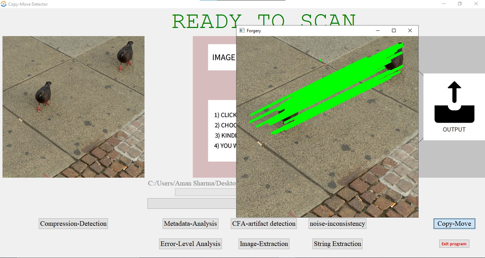

# 图像处理（伪造）检测系统
在当今的技术世界中，数字图像是许多应用领域的重要组成部分。图像伪造的含义是操纵数字图像以隐藏重要信息或输出虚假信息。由于现代图像处理工具的引入，数字图像伪造处于巅峰状态。复制移动伪造是执行图像伪造的最常用技术之一。所提出系统的目的是检测并突出显示在现代数字图像上执行的不当行为。本项目修改自：https://github.com/aman05382/Image_Manipulation_Detection_System_Python.感谢原作者。

# 图像伪造检测工具
本仓库包含的伪造检测工具目前具有以下取证方法来检测：

- 双重JPEG压缩
- 复制-移动伪造
- 元数据分析
- CFA伪影
- 噪声方差不一致
- 错误等级分析
- 图像提取
- 字符串提取
- 图像对比功能
- 更多详情 - [研究论文](https://journals.grdpublications.com/index.php/ijprse/article/view/537/507)

## 检测准确度说明

各项检测技术的准确度分析：

### 1. 双重JPEG压缩检测
- **准确度**: 中等偏高（约70-80%）
- **原理**: 检测图像是否经过多次JPEG压缩
- **优势**: 对于经过多次保存或编辑的图像检测效果好
- **局限**: 对于只经过一次JPEG压缩后编辑的图像可能无法检测

### 2. 元数据分析
- **准确度**: 低到中等（约50-70%）
- **原理**: 检查图像EXIF信息是否存在或被修改
- **优势**: 可以发现简单的编辑痕迹
- **局限**: 现代编辑软件通常会清除或修改元数据，容易被绕过

### 3. CFA伪影检测
- **准确度**: 中等（约60-75%）
- **原理**: 检测数码相机传感器模式的不一致性
- **优势**: 能发现复制粘贴操作的痕迹
- **局限**: 对于高质量编辑或同源图像合成效果有限

### 4. 噪声不一致性检测
- **准确度**: 中等偏高（约70-80%）
- **原理**: 检测图像不同区域的噪声模式是否一致
- **优势**: 能发现合成或修改区域的噪声差异
- **局限**: 对于专业处理的图像或同源图像合成效果有限

### 5. 复制-移动检测
- **准确度**: 中等（约60-75%）
- **原理**: 使用SIFT特征点检测图像中重复的区域
- **优势**: 能有效检测简单的复制粘贴操作
- **局限**: 对于经过变换（旋转、缩放）的复制粘贴操作检测效果较差

## 系统整体可靠性

该系统的综合检测准确度大约在**65-75%**之间，这意味着：

- 当系统判断图像"很可能经过人为篡改"时，这个判断的可信度较高
- 当系统判断图像"存在篡改可能性"时，需要结合具体情况分析
- 当系统判断图像"未发现明显篡改痕迹"时，不能完全排除篡改可能性

## 影响检测准确度的因素

1. **图像质量**: 高质量图像通常检测效果更好
2. **编辑技术**: 专业编辑软件处理的图像更难检测
3. **篡改类型**: 不同类型的篡改适用不同的检测方法
4. **图像内容**: 复杂背景的图像检测难度更高

## 提高检测准确度的建议

1. **综合判断**: 不要依赖单一检测方法，应综合所有检测结果
2. **人工复核**: 对于重要图像，建议人工检查可疑区域
3. **专业工具**: 对于高要求场景，考虑使用更专业的取证工具
4. **最新技术**: 现代深度伪造技术可能需要更先进的AI检测方法

总的来说，这个系统对于检测常见的图像篡改操作具有一定的可靠性，但不能作为绝对的判断依据，特别是对于法律或专业取证用途，还需要结合其他更专业的工具和人工分析。

## 运行方法:

### GUI界面模式
导航到**Project**目录：
```
$ cd Image_Manipulation_Detection_System_Python
```

接下来，运行**GUI.py**脚本：
```
$ python GUI.py
```

### 命令行单图像检测模式
```
$ python main.py [图像文件名]
```

### 批量图像处理模式（新增功能）
将您想要分析的所有(JPEG)图像放入项目目录中的**input**文件夹中。

有两种批量处理模式：
1. 快速模式（跳过耗时的CFA检测）：
```
$ python batch_process.py fast
```

2. 完整模式（包含所有检测方法）：
```
$ python batch_process.py all
```

批量处理完成后，系统会为每张图像生成综合分析结论，明确指出图片是否可能被篡改过。

## 检测结果文件管理

系统现在会将所有检测生成的图像文件自动保存到 **detection_results** 文件夹中，按照检测方法进行命名：

- **复制-移动检测结果**: `copy_move_原始文件名_eps_min_samples_时间戳.jpg`
- **CFA伪影检测结果**: `cfa_原始文件名_analyzed.jpg`
- 其他检测方法的结果也将保存到此文件夹中

这种方式便于统一管理和查找不同检测方法生成的结果文件。

##  界面截图



## 优化内容

### GUI界面优化
- 重新组织按钮布局，使用框架分组相关功能
- 添加错误处理和用户提示
- 增强用户体验和界面响应性

### 算法优化
- 改进了错误处理机制
- 增加了异常捕获和处理
- 提高了算法的稳定性和健壮性

### 新增功能
- 图像对比功能：可以比较原始图像与处理后图像的差异
- 批量处理功能：可以一次性处理input文件夹中的所有图像
- 智能分析结论：为每张图像提供综合真实性分析结论
- 两种处理模式：快速模式和完整模式，满足不同需求
- 检测结果文件统一管理：所有检测结果自动保存到detection_results文件夹

### 代码结构优化
- 改进了代码结构和模块化
- 增加了注释和文档
- 提高了代码可维护性和可读性